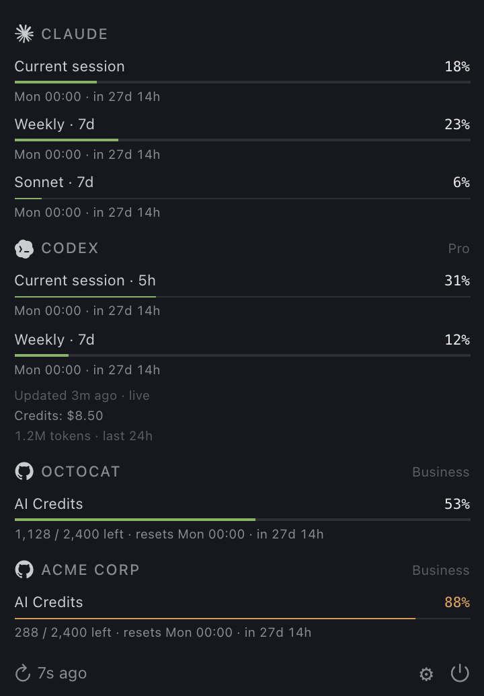
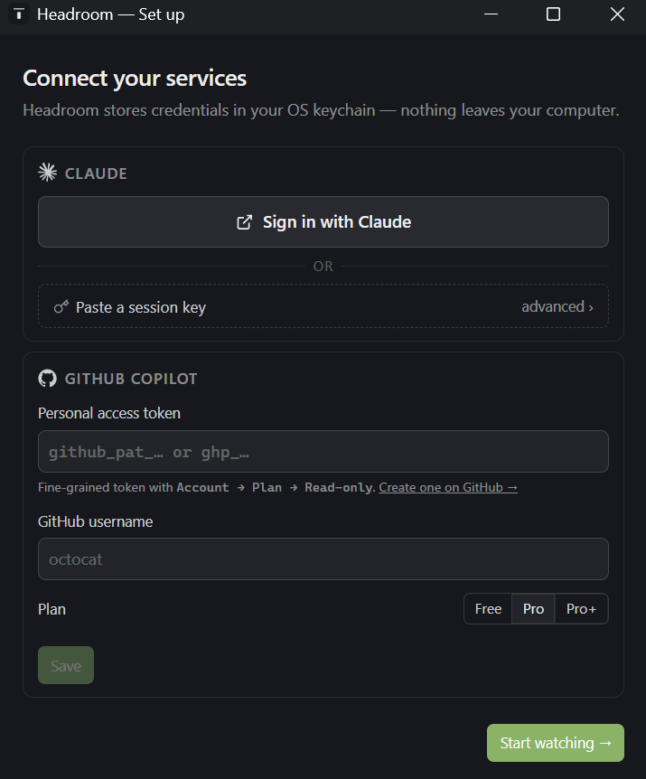
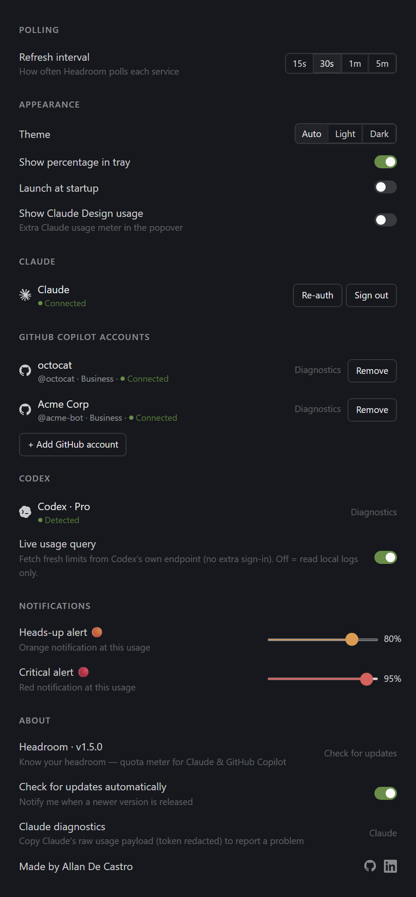

<p align="center">
  
</p>

<h1 align="center">Headroom</h1>

<p align="center">
  <strong>Know your headroom — a menu bar app that tracks Claude Code and GitHub Copilot quotas before you hit them.</strong>
</p>

<p align="center">
  <a href="https://github.com/allandecastro/headroom/releases/latest"></a>
  
  <a href="https://github.com/allandecastro/headroom/actions/workflows/ci.yml?query=branch%3Amain"></a>
</p>

<p align="center">
  
  
  
</p>

<p align="center">
  
  
  
  
</p>

<p align="center">
  <a href="#features">Features</a> &bull;
  <a href="#install">Install</a> &bull;
  <a href="#development">Development</a> &bull;
  <a href="#documentation">Documentation</a>
</p>

---

Headroom sits in your menu bar and shows, at a glance, how much of your AI coding assistant budget you have left — across the rolling 5-hour window, the 7-day weekly cap, and the monthly Copilot allowance. It tells you when to switch from Opus to Sonnet, how long until the next reset, and projects whether you'll make it to Monday at your current pace.

It is built for developers on Claude Pro/Max and Copilot Pro/Pro+ who actually use these tools all day and have run into the "usage limit reached" wall mid-task.

---

## Screenshots

<p align="center">
  
</p>

<p align="center"><sub>The menu-bar popover — live quotas, reset countdowns, burndown projection.</sub></p>

<p align="center">
  
  &nbsp;
  
</p>

<p align="center"><sub>Onboarding &nbsp;·&nbsp; Settings</sub></p>

---

## Features

- **Live quota tracking** for Claude (current session, weekly all-models, weekly Sonnet, weekly Opus, optional Claude Design) and GitHub Copilot (monthly premium requests, AI Credits after June 1 2026).
- **Tray icon** colour-coded green / amber / red from the worst quota across services; hover shows the percentage; the tray menu offers Open / Set up accounts / Settings / Quit.
- **7-day burndown** — a per-quota sparkline of recent utilization plus an _"On track · ~N% by reset"_ projection that flips to _"On track to exceed · full in Xd"_ if you're pacing past the cap.
- **Magic sign-in for Claude** — _"Sign in with Claude"_ opens an embedded webview that grabs the session cookie; paste-a-session-key fallback under _Advanced_. **Copilot** uses a one-step paste flow with a built-in _"Create one on GitHub →"_ button (the billing endpoint we call requires a fine-grained PAT permission that classic OAuth scopes can't grant — see [SPEC.md § Auth flows](SPEC.md#auth-flows)).
- **Credentials in the OS keychain** — Windows Credential Manager / macOS Keychain / Secret Service on Linux. Nothing leaves your machine.
- **Configurable threshold notifications** — orange "heads-up" and red "critical" alerts at user-set percentages, fired once per crossing.
- **Launch at login** + **single-instance lock** — second launches surface the running tray instead of stacking icons.
- **Live theme switching** (auto / light / dark) and a popover that auto-fits its content above the taskbar.

---

## Status

**v1.0.0** — first public release. The data acquisition strategies for both Claude and Copilot run live against the official endpoints; credentials are persisted in the OS keychain; the burndown + sparkline + recent-burn-rate pace ship in the popover; notifications, autostart, single-instance lock, configurable thresholds, and the click-to-expand chart are all in. See [CHANGELOG.md](CHANGELOG.md) for the full release notes and [FAQ.md § Scope](FAQ.md#scope) for what is and isn't on the table next.

---

## Install

### From a release

Grab the installer for your platform from the [Releases](https://github.com/allandecastro/headroom/releases) page:

- **Windows:** `Headroom_x.y.z_x64_en-US.msi` (per-user install; registers the AppUserModelID so toast notifications correctly attribute to "Headroom").
- **macOS:** `Headroom_x.y.z_aarch64.dmg` / `_x64.dmg`.
- **Linux:** `Headroom_x.y.z_amd64.AppImage` or `.deb`.

After installing, launch from the Start Menu / Launchpad and look in your system tray (Windows 11 may hide new tray icons under the `^` overflow — drag the icon out once and it stays visible).

### From source

You need Rust (1.78+) and Node.js (20+) installed.

```bash
git clone https://github.com/allandecastro/headroom.git
cd headroom
npm install
npm run tauri dev
```

The first launch will be slow — Cargo compiles every Rust dependency on the cold path. Subsequent launches take a few seconds.

---

## Development

### Project layout

```
headroom/
├── src/                    # React popover + settings UI
│   ├── components/         # TokenCard, onboarding, shared UI primitives
│   ├── lib/                # Tauri IPC wrappers, formatters, useFitWindow
│   ├── App.tsx             # Popover
│   ├── SettingsPanel.tsx   # Settings window
│   ├── OnboardingFlow.tsx  # Onboarding window
│   └── main.tsx
├── src-tauri/              # Rust backend
│   ├── src/
│   │   ├── sources/        # QuotaSource trait + claude.rs, copilot.rs
│   │   ├── commands.rs     # Tauri IPC handlers exposed to the renderer
│   │   ├── credentials.rs  # OS keychain wrapper
│   │   ├── history.rs      # Persisted per-quota usage time series
│   │   ├── notifications.rs# Threshold-crossing desktop alerts
│   │   ├── orchestrator.rs # Poll loop + classification
│   │   ├── projection.rs   # Burndown projection + recent-burn-rate pace
│   │   ├── settings.rs     # User preferences, atomic JSON persist
│   │   ├── tray.rs         # Tray icon state machine
│   │   ├── lib.rs          # AppState + run() wiring
│   │   └── main.rs
│   ├── Cargo.toml
│   └── tauri.conf.json
├── docs/                   # Mockups + screenshots used in this README
└── .github/                # Issue / PR templates + CI + release workflows
```

### Useful commands

| Command                                                                    | What it does                                          |
| -------------------------------------------------------------------------- | ----------------------------------------------------- |
| `npm run dev`                                                              | Vite dev server (renderer only, no tray)              |
| `npm run tauri dev`                                                        | Full app with hot-reload on both Rust and React sides |
| `npm run lint`                                                             | ESLint + Prettier on the renderer                     |
| `npm run typecheck`                                                        | TypeScript without emit                               |
| `cd src-tauri && cargo clippy --all-targets --all-features -- -D warnings` | Rust linter (matches CI)                              |
| `cd src-tauri && cargo test --all-features`                                | Rust unit + integration tests (matches CI)            |
| `npm run tauri build`                                                      | Production build for the current host platform        |

### Tauri config notes

The popover, onboarding, and settings windows are normal decorated windows with an opaque background — vibrancy/Mica was tried and shelved (it interfered with the auto-fit-to-content sizing and made the small popover read as "ghosty" when nothing was behind it). The popover anchors to the bottom-right of the work area; settings/onboarding centre within the usable area so neither slips behind the taskbar.

The tray is built **only in code** (`src-tauri/src/tray.rs`) — `tauri.conf.json` must **not** also declare a `trayIcon`, or two icons appear in the system tray.

#### Regenerating icons

Tray icons (state-dependent, rasterized from SVG sources in `assets/tray/`):

```bash
python3 scripts/build_tray_icons.py
```

App bundle icons (from the brand mark SVG):

```bash
rsvg-convert -w 1024 -h 1024 \
  assets/headroom-app-icon.svg -o /tmp/headroom-source.png
npx tauri icon /tmp/headroom-source.png
rm /tmp/headroom-source.png
```

Both workflows require `rsvg-convert` (librsvg):

```bash
brew install librsvg
```

---

## Documentation

- [SPEC.md](SPEC.md) — architecture, data sources, auth flows
- [DESIGN_SYSTEM.md](DESIGN_SYSTEM.md) — colors, typography, components, icons
- [CHANGELOG.md](CHANGELOG.md) — release history
- [CONTRIBUTING.md](CONTRIBUTING.md) — code style, PR process
- [FAQ.md](FAQ.md) — common questions about setup, privacy, scope, troubleshooting
- [SECURITY.md](SECURITY.md) — security policy + how to report a vulnerability

---

## Acknowledgments

Headroom exists because the data acquisition problem had already been solved by other widgets we studied:

- [SlavomirDurej/claude-usage-widget](https://github.com/SlavomirDurej/claude-usage-widget) — Electron implementation, embedded webview auth pattern
- [rishi-banerjee1/claude-usage-widget](https://github.com/rishi-banerjee1/claude-usage-widget) — Swift single-file approach, Cloudflare retry logic
- [bristena-op/copilot-usage-tracker](https://github.com/bristena-op/copilot-usage-tracker) — confirmed the official GitHub billing API endpoint for premium requests

Headroom's contribution is combining both services in one native menu bar app, with multiple auth paths and a cohesive design.

---

<p align="center">
  <sub>Crafted with <span aria-label="love">❤️</span> and AI by
  <a href="https://github.com/allandecastro">Allan De Castro</a></sub>
</p>

<p align="center">
  <a href="LICENSE"></a>
</p>
